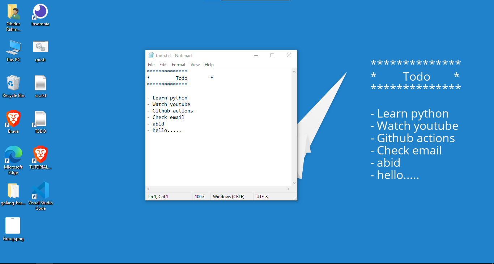

## Todo Wallpaper
> A utility that keeps the to-do list on desktop background. File watcher in go and the image generator written in pyhon.



### How to use?

#### Option: 1

- [Download the latest release](https://github.com/ohidurbappy/todo-wallpaper/releases/latest/download/todo-wallpaper.exe) and install it.!

- You will get a TODO shortcut on your desktop. Start adding to your list...

#### Option: 2

- Clone the repo

- Build the source to get binary executable.

```bash
go-winres simply --icon icon.png --manifest gui
go build -ldflags="-H windowsgui"

```

- Download Nuget python package and keep it under `py` directory in
the same location and install required packages

```bash
python.exe -m pip install Pillow

```

> If you don't like to use Nuget package, you need to change the location of python binary in `main.go` file build it accordingly.

- Create a shortcut of `todo-app.exe` in startup folder.

- Create shortcut of `todo.txt` on the desktop for easy access.


Whenever the `todo.txt` file is changed the wallpaper will be updated.


### TODO:
- [ ] Ability for user to position the todo list
- [ ] Random wallpaper from Bing image/similar source
- [ ] Use user's current wallpaper by default
- [ ] Pick contrasting color with respect to the wallpaper
